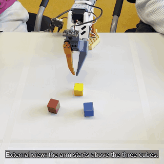
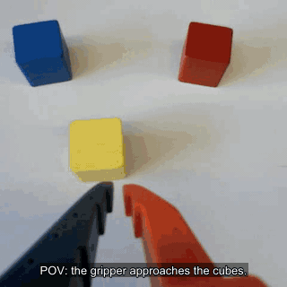
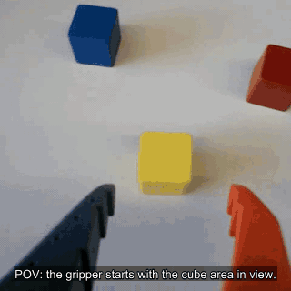

# VLA-DataEngine

Synthetic-data engine that turns a handful of raw robot trajectories into dense, deployment-ready LeRobot datasets — and a marketplace for selling them. See `PITCH.md` and `DEMO_SCRIPT.md` for the business framing.

## Architecture

Three processes:

- **`frontend`** — Next.js 14 + Tailwind on `:3000`. Three pages:
  - **`/`** Collection. Left = robot live stream (rerun iframe) + 4-stage recording timeline + Start/Stop. Right = active-session card + auto-caption stream from Claude + free-form chat scoped to the session.
  - **`/datasets`** Marketplace. Grid of dataset cards with domain / status / search filters.
  - **`/datasets/[id]`** Detail. Episode list + video replay + scrubber-synced joint timeseries chart + frame-caption track.
- **`backend`** — FastAPI on `:8000`. Loads `data/datasets/*/manifest.json` and episode metadata at startup; serves REST for datasets/sessions/episodes, SSE `/api/chat` (Claude with prompt caching, grounded on session / dataset / episode context), SSE `/api/sessions/{id}/captions/stream` (rolling Claude captions driven by `services/caption_engine.py`), WS `/ws/robot` fan-out.
- **`robot_bridge`** — FastAPI on `:8001`, **host process** (needs USB → SO-101). WS `/ws` publishes recording stage events; `POST /record` triggers a scripted mock motion (`motions/recording_stages.yaml`: `arming → recording → captioning → saved → idle`) so the Collection page animates end-to-end without the arm plugged in.

Frontend + backend are containerized. `robot_bridge` runs on the host because Docker Desktop on macOS can't reach USB cleanly. The backend reaches the host via `host.docker.internal:8001`.

## Demo clips

<table>
  <tr>
    <th>Correct blue pick</th>
    <th>Incorrect red pick</th>
  </tr>
  <tr>
    <td align="center">
      <br>
      <sub>External view</sub>
    </td>
    <td align="center">
      <br>
      <sub>External view</sub>
    </td>
  </tr>
  <tr>
    <td align="center">
      <br>
      <sub>First-person view</sub>
    </td>
    <td align="center">
      <br>
      <sub>First-person view</sub>
    </td>
  </tr>
</table>

<p align="center">
  <sub>Timed caption tracks:
    <a href="demo_clips/blue_ext.vtt">blue_ext.vtt</a> ·
    <a href="demo_clips/blue_pov.vtt">blue_pov.vtt</a> ·
    <a href="demo_clips/red_ext.vtt">red_ext.vtt</a> ·
    <a href="demo_clips/red_pov.vtt">red_pov.vtt</a>
  </sub>
</p>

## Data layout

```
data/
  active_session.json                    # which session is on the mat (edit live)
  datasets/
    medical-vacutainer-v1/
      manifest.json                      # name, domain, robot, status, price, ...
      cover.svg
      episodes/ep_001/{metadata.json, video.mp4, timeseries.csv, captions.json}
      episodes/ep_002/...
    logistics-parcel-sort-v0/...
```

`video.mp4` files are empty placeholders out of the box — drop in real clips to make the detail page play. Everything else (timeseries, captions, manifest) is seeded.

## Run

Prereqs: Docker Desktop, [`uv`](https://docs.astral.sh/uv/), an Anthropic API key.

```bash
cp .env.example .env       # paste ANTHROPIC_API_KEY into .env
uv pip install -e robot_bridge
```

Terminal 1 — host-side robot bridge:
```bash
uv run python -m robot_bridge.app.main
```

Terminal 2 — backend + frontend:
```bash
docker compose up --build
```

Open <http://localhost:3000>.

## Demo controls

- Edit `data/active_session.json` and change `dataset_id` between `medical-vacutainer-v1` and `logistics-parcel-sort-v0` — the Collection page picks it up within ~3s without restart.
- Click **Start recording** on `/` to animate the 4-stage timeline and start the Claude caption SSE.
- Visit `/datasets/medical-vacutainer-v1` and pick an episode — the joint timeseries and frame captions stay in sync with the video scrubber.

## Recorded mode (LeRobot v3 dataset)

The Collection page's video pane has a **Live / Recorded** toggle. Live mode shows the rerun iframe (unchanged). Recorded mode reads a real LeRobot v3 dataset at `data/data/` (so100 follower, 41 episodes, 11,224 frames @ 30 fps, AV1 wrist-cam clips), exposes an episode dropdown, and plays only the time-slice of the underlying `.mp4` that belongs to the selected episode. The right pane swaps to a frame-data inspector showing each joint's action target vs observation.state, indexed by `currentTime * fps`.

The wrist-cam video is AV1 — works in **Chrome / Edge / Firefox**; Safari shows a blank player but the rest of the panel still renders.

---

> Hardware setup for the SO-101 arms lives in [`README.robotum.md`](README.robotum.md) (the upstream EuroTech tutorial).
